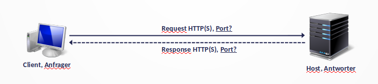

# Aufgabenblatt 30

**Aufgabe 1**

Vervollständigen Sie das angegebene Kommunikationsschema.

`Ports: 80, 443`

**Aufgabe 2**

Blockieren Sie die Kommunikation als Client mit iptables. Wie sehen die korrekten Regeln aus?

`sudo iptables -A OUTPUT -p tcp --dport 80 -j DROP
sudo iptables -A OUTPUT -p tcp --dport 443 -j DROP
`

**Aufgabe 3**

Blockieren Sie die Kommunikation als Webserver mit iptables. Wie sehen die korrekten Regeln aus?

`
sudo iptables -A INPUT -p tcp --dport 80 -j DROP
sudo iptables -A INPUT -p tcp --dport 443 -j DROP

`

